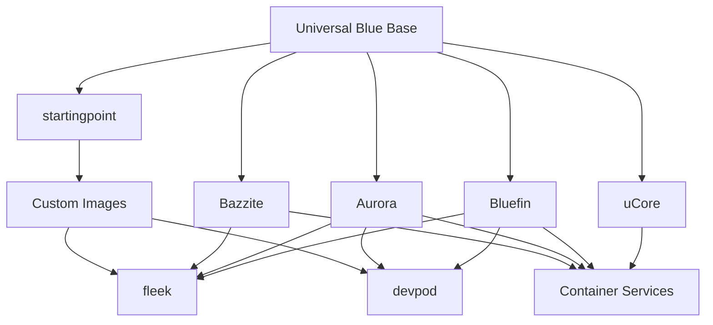

# Universal Blue Integration Guide

Universal Blue projects are designed to work together seamlessly. This guide explains how different tools and projects complement each other and can be combined for powerful workflows.

## Integration Architecture



## Core Integration Patterns

### 1. Desktop + Server Combination

**Pattern**: Use a Universal Blue desktop (Bluefin/Aurora/Bazzite) with uCore servers

**Benefits**:

- Consistent tooling and management across desktop and server
- Same container technologies and workflows
- Unified update and security model
- Shared knowledge and documentation

**Example Setup**:

```bash
# On your Bluefin desktop, manage uCore servers
podman run --rm -it registry.gitlab.com/ublue-os/ucore:stable

# Deploy applications to uCore servers using same containers
# Develop locally on Bluefin, deploy to uCore production
```

### 2. Multi-Environment Development

**Pattern**: Combine Bluefin + devpod + fleek for comprehensive development setup

**Components**:

- **Bluefin**: Primary development workstation
- **devpod**: Isolated development environments
- **fleek**: Dotfiles and configuration synchronization

**Workflow**:

```bash
# 1. Set up fleek for dotfiles management
fleek init
fleek add zsh tmux neovim

# 2. Create development environments with devpod
devpod up --provider docker myproject
devpod ssh myproject

# 3. Access consistent environment across all setups
# Your fleek configuration follows you everywhere
```

### 3. Gaming + Development Hybrid

**Pattern**: Dual-boot or container approach with Bazzite + development tools

**Approaches**:

**Option A - Development Containers on Bazzite**:

```bash
# Run development environment in containers on Bazzite
distrobox create --name dev-env --image registry.fedoraproject.org/fedora:latest
distrobox enter dev-env
# Install development tools in container
```

**Option B - Gaming Containers on Bluefin**:

```bash
# Use gaming containers on development-focused Bluefin
flatpak install Steam
podman run -it --privileged bazzite-gaming-container
```

### 4. Team Environment Standardization

**Pattern**: startingpoint + devpod for organizational consistency

**Implementation**:

1. Create custom base image with startingpoint
2. Use devpod for standardized development environments
3. Distribute via container registry to team members

```yaml
# .devpod/devcontainer.json
{
  "name": "Team Development Environment",
  "image": "registry.company.com/team-base:latest",
  "features": { "ghcr.io/devcontainers/features/docker-in-docker": {} },
  "customizations":
    { "vscode": { "extensions": ["ms-vscode.vscode-typescript"] } },
}
```

## Tool Integration Matrix

| Base System | + fleek         | + devpod   | + Custom Containers | + uCore Backend |
| ----------- | --------------- | ---------- | ------------------- | --------------- |
| **Bluefin** | ✅ Perfect      | ✅ Ideal   | ✅ Native           | ✅ Excellent    |
| **Aurora**  | ✅ Great        | ✅ Good    | ✅ Native           | ✅ Excellent    |
| **Bazzite** | ✅ Good         | ⚠️ Limited | ✅ Native           | ✅ Good         |
| **uCore**   | ⚠️ Manual Setup | ❌ N/A     | ✅ Primary Use      | ✅ Native       |

## Common Integration Scenarios

### Scenario 1: Full-Stack Developer

**Setup**: Bluefin + fleek + devpod + uCore staging server

```bash
# Local development on Bluefin
code my-web-app/

# Isolated environments for different projects
devpod up --provider kubernetes project-a
devpod up --provider docker project-b

# Consistent shell and tools via fleek
fleek apply

# Deploy to uCore staging server
podman build -t my-app .
podman push registry.myserver.com/my-app
ssh ucore-server "podman run -d registry.myserver.com/my-app"
```

### Scenario 2: Content Creator + Gamer

**Setup**: Aurora primary + Bazzite gaming container + fleek sync

```bash
# Content creation on Aurora with KDE
kdenlive my-video.mp4

# Gaming in isolated environment
distrobox create --name gaming --image bazzite-desktop
distrobox enter gaming
steam # Games don't interfere with main system

# Sync configurations
fleek sync # Keeps settings consistent
```

### Scenario 3: DevOps Team

**Setup**: Custom startingpoint image + devpod + uCore infrastructure

```dockerfile
# Custom team image based on Bluefin
FROM ghcr.io/ublue-os/bluefin:latest

# Add team-specific tools
RUN rpm-ostree install kubectl helm terraform
RUN rpm-ostree commit
```

### Scenario 4: Home Lab Enthusiast

**Setup**: Any desktop + multiple uCore servers + container orchestration

```bash
# Manage multiple uCore servers from desktop
podman-remote connect ucore-server-1
podman-remote connect ucore-server-2

# Deploy services across servers
podman play kube my-homelab.yaml --host ucore-server-1
podman play kube monitoring.yaml --host ucore-server-2
```

## Data Sharing and Persistence

### Home Directory Compatibility

All Universal Blue projects use compatible home directory structures:

```
/home/user/
├── .config/          # Application configurations
├── .local/share/     # Application data
├── Documents/        # User documents
├── containers/       # Container storage (shared)
└── .fleek/          # fleek configuration (if used)
```

### Container Data Persistence

```bash
# Shared container storage across all UB projects
~/.local/share/containers/  # Podman containers and images
~/.config/containers/       # Container configurations

# Flatpak applications (desktop projects)
~/.local/share/flatpak/     # User Flatpak applications
~/.var/app/                 # Flatpak application data
```

### Configuration Synchronization

With fleek, maintain consistent configurations across:

- Shell environments (zsh, fish, bash)
- Development tools (git, vim, tmux)
- Terminal emulators
- Custom scripts and aliases

## Best Practices for Integration

### 1. Container Strategy

- Use rootless containers when possible
- Share container registries across environments
- Implement consistent tagging strategies
- Use volumes for persistent data

### 2. Configuration Management

- Use fleek for user-level configurations
- Store team configurations in git repositories
- Use environment variables for environment-specific settings
- Document configuration dependencies

### 3. Development Workflow

- Develop locally, deploy to containers
- Use devpod for isolated project environments
- Test on uCore before production deployment
- Maintain development/staging/production parity

### 4. Security Considerations

- Use separate containers for different security contexts
- Keep sensitive data in proper secret management
- Regular updates across all Universal Blue systems
- Monitor container vulnerabilities

## Migration and Switching

### Between Desktop Projects

1. Export user data and configurations
2. Install new Universal Blue project
3. Import user data to new system
4. Reinstall Flatpak applications
5. Restore container images and configurations

### Adding Tools Gradually

Start with base system and add integration tools incrementally:

1. Install and configure base Universal Blue project
2. Add fleek for configuration management
3. Introduce devpod for development environments
4. Deploy uCore servers as needed
5. Consider custom images for specialized requirements

### Rollback Strategies

All Universal Blue projects support atomic rollbacks:

```bash
# Roll back system changes
rpm-ostree rollback

# Container rollbacks
podman tag previous-version:latest current-app:latest
podman restart current-app
```

The Universal Blue ecosystem is designed for flexibility—start simple and add complexity as your needs grow!
